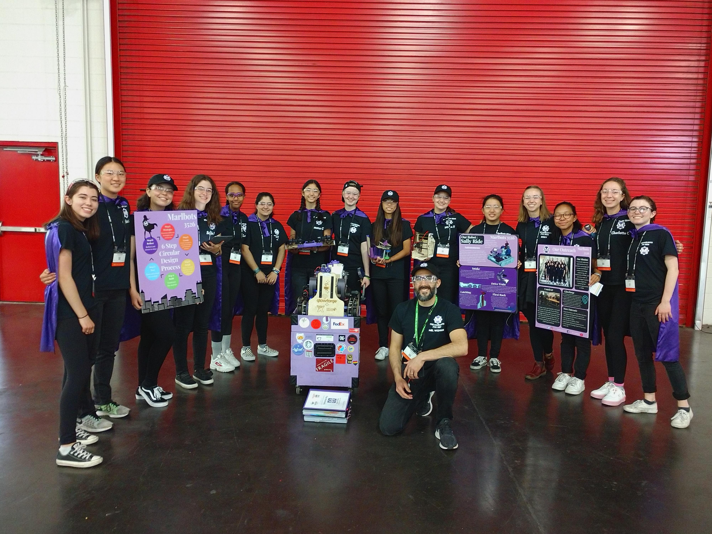

.center[
## Coding Across the Curriculum
]

.center[
2025 ICGS Conference    
Philadelphia   
June 24, 2025   

Darren Kessner, PhD  
_Program Head of Computer Science and Software Innovation_    
_Marlborough School, Los Angeles_  
]

.split-50[
.column[ .center[

]]
.column[ .center[

]]
]

---

### Marlborough School

* Independent girls' school, located in Los Angeles

* Middle School (7-9) and Upper School (10-12)

* ~500 total students

.center[

]

---

### Who Am I?
.split-40[
.column[
.center[
  
  
  
  

]
]

.column[
.center[
__Dr. Darren Kessner__
]

- BS, MA in Mathematics

- PhD in Bioinformatics

- Software developer for &gt;25 years  

 
.center[
__Marlborough School__
]

- Program Head of Computer Science and Software Innovation (11 years)

 
.center[
__Ellison Medical Institute__  
]

- Senior Software Engineer, AI and Advanced Molecular Medicine 

]
]

---

### Computer Science Program

- Emphasis on software projects that are creative, collaborative, and
interdisciplinary

- Low floor, high ceiling

- Open source software, open educational resources

  

---

### Computer Science Curriculum

* Core sequence
    * Computer Programming (Processing)

    * AP Computer Science A (Java)

    * Honors Computer Science Projects (Java, Javascript, Python, ...)

 

* Coding in other classes

    - Math (Python)

    - Physics (Scratch)

    - Robotics (Java)

---

### Video Games

Students write video games in Processing / Java.  

Joysticks and buttons are mapped to keyboard controls on the video game
cabinet.  

<small>
_Toys are not really as innocent as they look.   
Toys and games are preludes to serious ideas._  
__ Charles Eames __
</small>

---

### Robotics

Students write Java code to control their robots.

.split-50[
.column[ .center[
  
 
  
]]

.column[ .center[

 
  
]]
]

---

### Math / Science

- Precalculus: Drawing with parametric curves (Python turtle graphics)

- Multivariable Calculus: 3D drawings with parametric surfaces (custom p5.js)

.split-50[
.column[ .center[
  
 
  
]]

.column[ .center[

 
  
]]
]

---

### History

TODO: more pix

---

### Visual Arts

  

TODO: more pix

[Intro Coding](https://docs.google.com/presentation/d/e/2PACX-1vQbl6ehE3egw6l0cnLnrl1AlRIriBe2pgYAXdjF5n5I6vR_o-CkwHrCaVr6WZ5ICrY6jwYtYLZc7BsZ/pub?start=false&loop=true&delayms=3000#slide=id.g4bb6c39a5a_0_0)  
[SPARC Celebration 2019](https://photos.google.com/share/AF1QipPo1kFd0xEwpD_Vy1_-TKytODE97tlvxcIDkPAunK4dpsqHqm3ei2dDqHQMhChOYQ?key=d2NKUTZkT1p1c0RueTVSekh5QTgzZU9ucHJDN2RR)
[STEM + Arts 2018](https://photos.google.com/share/AF1QipNcahE5U7niniblHE919BuSblMAyAmF7tscjNpcfUysr0j5ff5hSiFekeNLjqInrA?key=VlBxbUM4b2RlUTNYd3Nvdzg0bmdLR2ZBcFM2Wkhn)  
[SPARC Celebration 2018](https://photos.google.com/share/AF1QipN0fegBzrSbaMfKjGkLmshivHj3aWR6vB2GoS7Jyj6g1fM5E9XFEmQLtl-G8dTvmQ?key=ekMweUpJR1c4Zm1sLV9BUXN0NjhmVjZDYktySDlR)
[STEM + Arts 2017](https://photos.google.com/share/AF1QipOYErHZ6rmoobXG3zS9jQ7RG6VIFG3rLg6cVSaqXo79FLSlwtyufeV8b-JLC_xAQA?key=OS0tdEM0bERudnhHeGR4Q05YclpqWF8xeExDWEdn)

---

### Performing Arts

TODO: 1 more pix

---

### Honors Research

Marlborough Academic Research 

TODO: data analysis

---

### Social Justice

TODO: food desert project

---

### Journalism

---

### Code Violet / AI club

TODO: more pix

---

### Celebration of Innovation 

 
 

---

### Code paths (?)

- Processing / Java
- p5.js / Javascript
- Python

---

### Resources and Links

 

Darren Kessner  
[https://dkessner.github.io](https://dkessner.github.io)

 

Marlborough STEM+ Program   
[https://marlborough-school.github.io/stem_website](https://marlborough-school.github.io/stem_website)

 
.center[

]

